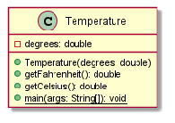
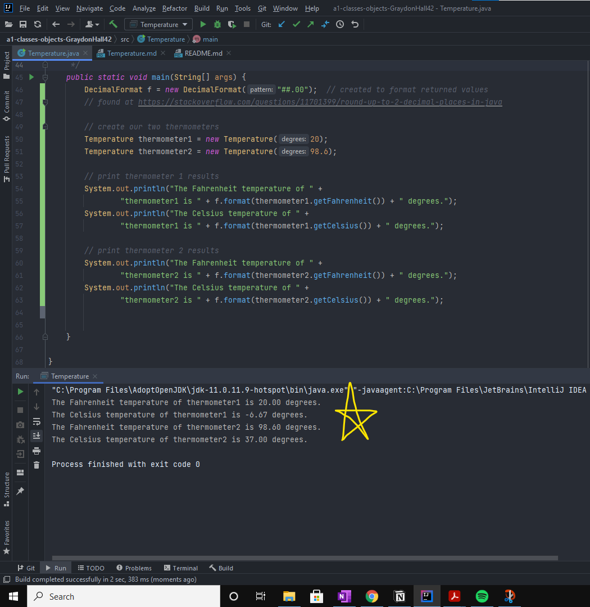

# Temperature report
Author: Graydon Hall

## UML class diagram

## Specification
This class represents temperature in units of Fahrenheit, and offers methods for the user to obtain the temperature in units of Celsius and Fahrenheit

## Execution and Testing
The following screenshot shows the output, after running the main method from within the Temperature class

