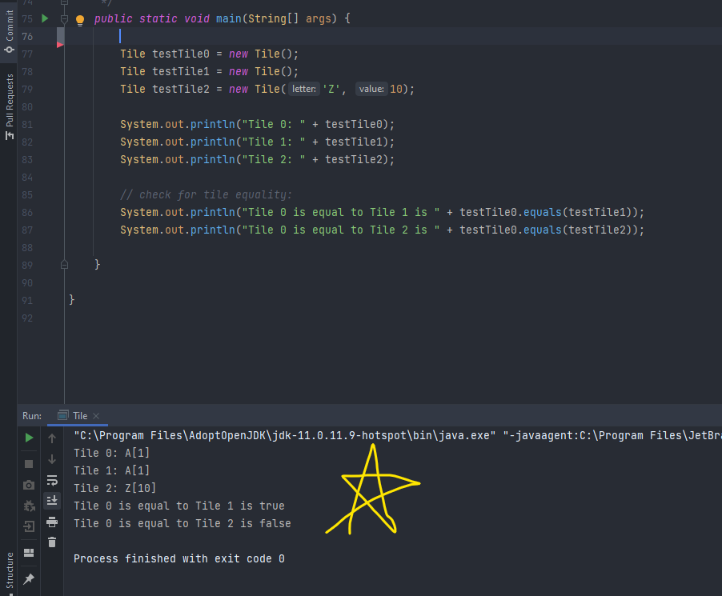

# Tile report
Author: Graydon Hall

## UML class diagram

## Specification
This class is designed to represent a Scrabble tile, giving it's Character, and it's score value in the game.

## Execution and Testing

