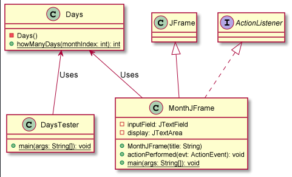
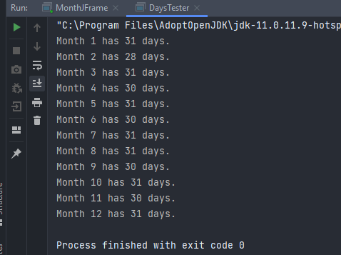
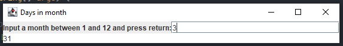

# Days in Month report
Author: Graydon Hall

## UML class diagram

## Execution and Testing

**Testing `Days` class**

**Days in Month GUI Usage**
 In order to use this GUI, the user should enter the index of the month they are interested in in the 
input field. In the image below, the user was interested in knowing how many days are in March, and hence
entered 3 since March is the third month. Note that the index must be an integer between 1 and 12 to recieve a valid input. 
Once the user enters the months index, they can simply press enter, and the days in that month will be returned. In this example,
March has 31 days, hence why the number 31 is in the display area on the bottom half of the GUI. 

