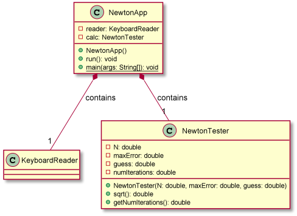
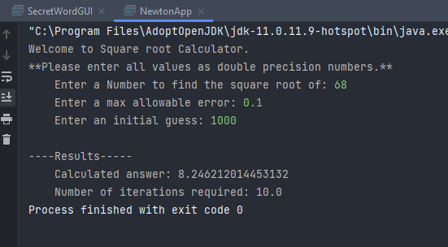
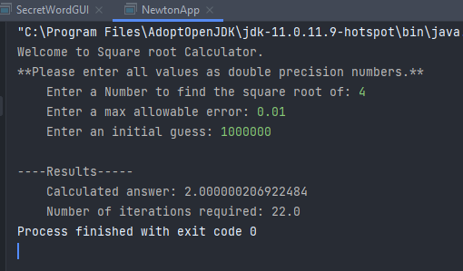
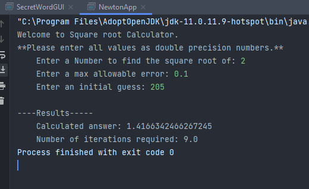

# Newton report
Author: Graydon Hall

## UML class diagram

## Execution and Testing
Screenshots demonstrating successful execution and outputs for at least 3 numbers. 
 
 
 

Explain why you chose these numbers for your test:  
I made sure to do one test with 4, since the square root of 4 is widely known to be equal to 2,
thus making it easy to see if the code was returning the correct output. After that, I chose 2 and 68
because I thought they covered a wide range. I also tried to input large numbers for the initial guesses, to ensure
the program didn't break under a wildly bad guess. 
