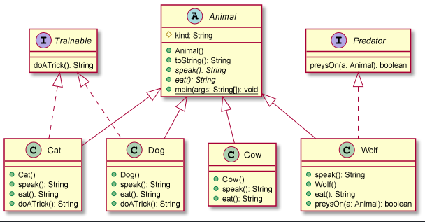
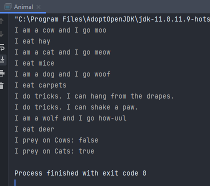

# Animals report
Author: Graydon Hall 

## UML class diagram

## Answers to Questions in step 6
Given the classes and interfaces you have defined, which of the following would be valid. Explain. If you don't know the answers, experiment by typing the code into your program and testing it.

a) `Trainable pet1 = new Cow();` 
b) `Animal pet2 = new Cat(); System.out.println(pet2.doATrick());` 
c) `Animal pet3 = new Cat(); System.out.println( ((Trainable)pet3).doATrick() );` 

a) gives an error because the cow class does not implement the trainable interface. 
b) also gives an error, that states:  
`java: cannot find symbol` 
`symbol:   method doATrick()` 
`location: variable pet2 of type Animal` 
this is because the animal class on it's own does not implement the trainable interface. If we replaced `Animal` 
with `Cat` or `var` the error would dissapear.  
c) does not give an error, since pet3 is cast to the trainable interface when the `doATrick()` method is called

## Execution and Testing

