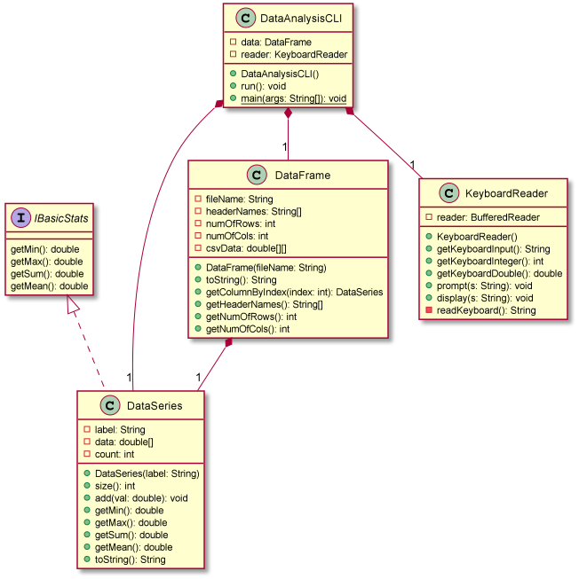
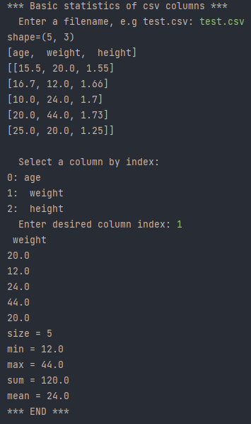
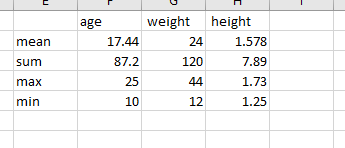
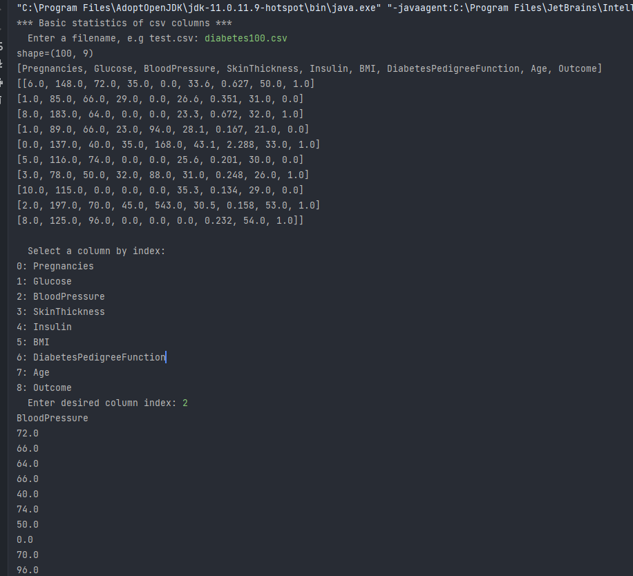
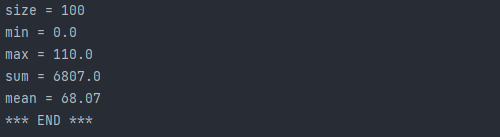
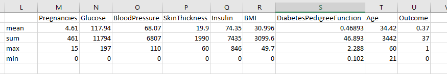

# Data Analysis report
Author: Graydon Hall

## UML class diagram
 

## Execution and Testing 
### Test on test.csv 
 
Verification on test.csv 
 

### Test on diabetes100.csv 
 
 
Verification on diabetes100.csv 
